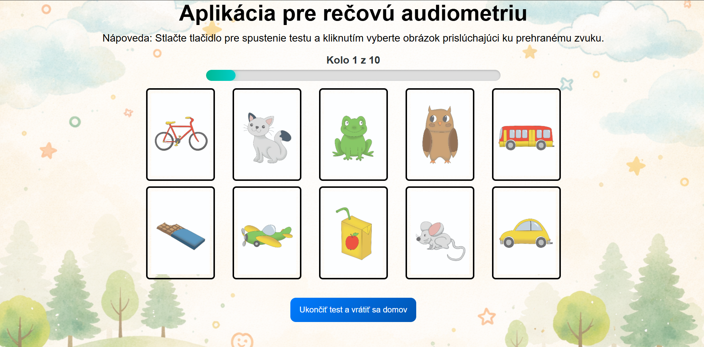
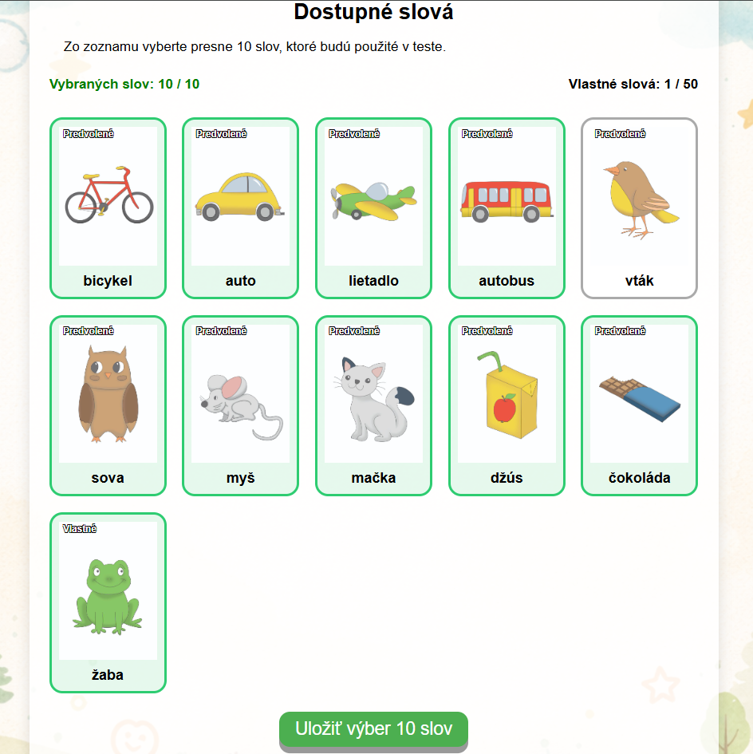
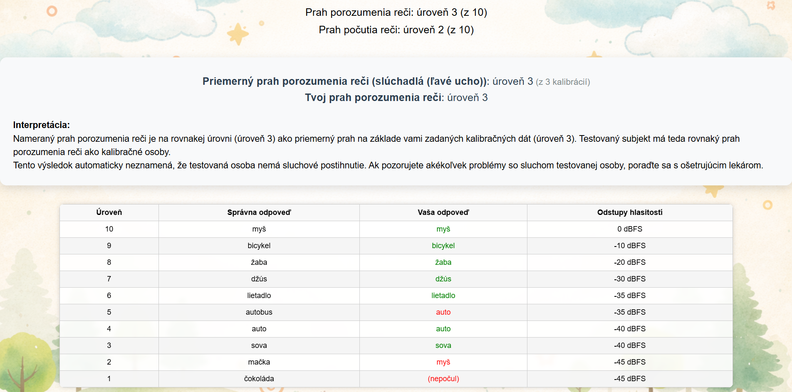

# 🦻 Hearing Screening App – Robot Tomáš Cards

A React-based hearing screening and speech audiometry application using picture cards and audio recordings. The app supports Slovak and Romani language versions, separate calibration modes, custom word selection, and user-defined test words.

> This project is a React migration and modernization of my original diploma thesis application, which was first built using HTML, CSS, and vanilla JavaScript.
> Original version: [Kartičky Robota Tomáš](https://github.com/samogdovin193-dotcom/RobotTomas)

---

## 🚀 Features

- 🌍 Slovak and Romani test versions
- 🔊 Test mode selection:
  - Speaker mode
  - Headphones mode

- 🎧 Separate calibration for:
  - Speaker
  - Left ear
  - Right ear

- ⚙️ Language-specific settings
- 🎚️ Adjustable dBFS volume levels for each test round
- 🖼️ Picture-card based word recognition test
- ✅ Select exactly 10 words for the test
- ➕ Add custom words with image and audio recordings
- ❌ Delete custom words
- 🧹 Calibration reset after confirmed changes to volume levels or selected words
- 📊 Results page with thresholds, answer table, and calibration comparison
- 💾 Local browser storage using localStorage and IndexedDB through Dexie.js
- 📱 Responsive layout

---

## 🛠️ Tech Stack

- React (Vite)
- TypeScript
- React Router DOM
- Dexie.js
- IndexedDB
- localStorage
- CSS (vanilla)

---

## 📁 Project Structure

```bash
src/
├── pages/
│   ├── ActiveTest.tsx
│   ├── Calibration.tsx
│   ├── Finish.tsx
│   ├── Home.tsx
│   ├── Manual.tsx
│   ├── Results.tsx
│   ├── Settings.tsx
│   ├── StartGame.tsx
│   ├── TestEarSelection.tsx
│   ├── TestSelection.tsx
│
├── hooks/
│   ├── useTestFlow.ts
│   ├── useCalibration.ts
│   ├── UseEnsurelang.ts
│
├── lib/
│   ├── db.ts
│   ├── testWords.ts
│   ├── utils.ts
│   ├── wordsDB.ts
│
├── styles/
│   ├── calibration.css
│   ├── finish.css
│   ├── home.css
│   ├── manual.css
│   ├── results.css
│   ├── selection.css
│   ├── settings.css
│   ├── shared.css
│   ├── start_test.css
│   ├── styles.css
│   ├── test.css
│
├── types/
│   ├── index.ts
│
├── utils/
│   ├── navigation.ts
│
├── App.tsx
└── main.tsx
```

---

## ⚙️ Setup & Installation

1. Clone the repo

   ```bash
   git clone https://github.com/samogdovin193-dotcom/hearing-screening-app.git
   cd hearing-screening-app
   ```

2. Install dependencies

   ```bash
   npm install
   ```

3. Run the app

   ```bash
   npm run dev
   ```

4. Open the local development URL shown in the terminal, usually:

   ```bash
   http://localhost:5173
   ```

---

## 🏗️ Production Build

Create a production build:

```bash
npm run build
```

The generated production files will be placed in:

```bash
dist/
```

---

## 🌍 Language Versions

The app supports two separate language versions:

- Slovak
- Romani

Each language version has its own:

- Word list
- Selected test words
- Custom words
- Volume settings
- Calibration data

This prevents Slovak and Romani settings or calibration results from affecting each other.

---

## 🎚️ Settings System

The settings page allows users to:

- Change dBFS volume levels for test rounds
- Reset volume levels to default values
- Select exactly 10 words for the test
- Add custom words
- Delete custom words

When volume levels or selected words are changed, the app shows a confirmation warning before saving. After confirmation, calibration data is deleted only for the currently selected language.

---

## ➕ Custom Words

Users can add custom words to the test.

Each custom word contains:

- Word name
- Image
- Speaker audio recording
- Left ear audio recording
- Right ear audio recording

Custom words are stored locally in the browser using IndexedDB.

If a custom word is deleted and it was part of the selected word list, the app removes it from the selection and clears calibration data for the current language after user confirmation.

---

## 🎧 Calibration System

Calibration categories include:

- Slovak speaker
- Slovak left ear
- Slovak right ear
- Romani speaker
- Romani left ear
- Romani right ear

This makes calibration independent for each language and listening condition.

---

## 🧪 Test Flow

During the test:

- Audio recordings are played in a randomized order
- Picture cards are displayed in a separate randomized order
- The user selects the picture that matches the played audio
- The app records answers
- The test ends after all rounds or after the defined stopping condition

If the saved word selection is invalid, for example fewer or more than 10 words are selected, the app falls back to the default word set for the current language.

---

## 💾 Local Data Storage

The app stores data locally in the browser.

It uses:

- `localStorage` for:
  - Volume settings
  - Selected word IDs
  - Temporary test results

- `IndexedDB` through Dexie.js for:
  - Calibration data
  - Custom words
  - Custom word images and audio files

No server-side database is used.

If browser data is cleared, saved calibration data, custom words, selected words, and volume settings may be removed.

---

## ✅ Validation & Safety Checks

The app includes several safeguards:

- Test cannot start before words are loaded
- Selected word list must contain exactly 10 words to be saved
- Invalid saved selections fall back to default words
- Calibration data is deleted only after user confirmation
- Calibration deletion affects only the current language
- Temporary object URLs for custom files are cleaned up when no longer needed

---

## 🎯 Future Improvements

- 🧪 Add automated tests
- 📤 Add export/import for custom words and settings
- 🧾 Add printable or downloadable results report
- 🔐 Optional user accounts for cloud synchronization

---

## 📸 Preview





## 🌍 Live Demo

👉 [Hearing screening app](https://hearing-screening-app-six.vercel.app/?lang=sk)

## 👨‍💻 Author

Built by Ing. Samuel Gdovin.
A frontend developer focused on learning React through real-world projects.

---

## 📄 License

This project is for educational purposes.
